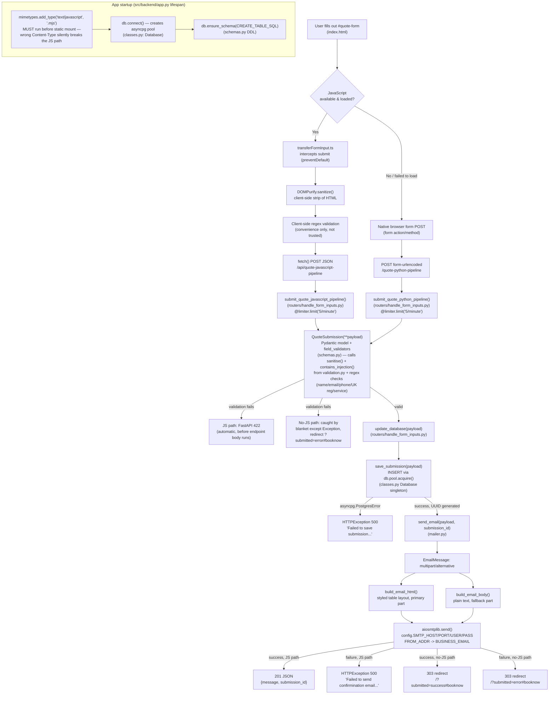

# Quote Submission Pipeline — Architecture

This documents the current, live request pipeline for the "request a quote" form (`#quote-form` in
`src/frontend/templates/index.html`), from browser submit through to email notification. It reflects
the backend as modularized into `src/backend/config.py`, `_typing.py`, `classes.py`, `schemas.py`,
`validation.py`, `mailer.py`, and `routers/handle_form_inputs.py` — `app.py` itself is now just app
wiring (FastAPI instance, middleware, static mounts, lifespan, and the `GET /` homepage route).

## Diagram

## Module-by-module walkthrough

| Layer | File | Responsibility |
|---|---|---|
| Form markup | `src/frontend/templates/index.html` | Renders `#quote-form` with `action="/quote-python-pipeline" method="post"` as the native no-JS fallback target. |
| Client JS | `src/frontend/typescript/transferFormInput.ts` | Intercepts submit (`event.preventDefault()`), runs input through DOMPurify (`DOMPurify.sanitize(value, { ALLOWED_TAGS: [] })`) and loose client-side regex checks, then `fetch()`-POSTs JSON to `/api/quote-javascript-pipeline`. Convenience only — never trusted as the security boundary. |
| App wiring | `src/backend/app.py` | FastAPI instance, `lifespan()` (DB pool connect/schema/close), CORS + `SecurityHeadersMiddleware`, static mounts (`/static`, `/dist`), the `mimetypes.add_type(".mjs")` gotcha, `app.include_router(handle_form_inputs.router)`, and the `GET /` `read_homepage` route (reads `?submitted=` for the no-JS success/error banner). |
| Config | `src/backend/config.py` | Env-loaded settings (`DATABASE_URL`, `DEBUG`, SMTP/email vars), the module logger, and the shared `limiter` (`slowapi.Limiter`) instance — defined here (a dependency-free leaf module) so both `app.py` and the router can import the same instance without a circular import. |
| Shared classes | `src/backend/classes.py` | `SecurityHeadersMiddleware` (adds `X-Content-Type-Options`, `X-Frame-Options`, `X-XSS-Protection` to every response) and `Database` — a thin asyncpg pool wrapper (`connect()`, `close()`, `ensure_schema()`), exposed as the `db` singleton that `routers/handle_form_inputs.py` also imports. |
| Types | `src/backend/_typing.py` | The `Service` enum (`Diagnostics`, `Tyres`, `Servicing`, `Batteries`, `Exhausts`, `Repairs`). |
| Sanitisation | `src/backend/validation.py` | `sanitise()` / `contains_injection()` (+ `INJECTION_PATTERNS`) — generic, form-agnostic helpers with no knowledge of `QuoteSubmission`, so any future form's Pydantic model can import and reuse them unchanged. |
| Schema | `src/backend/schemas.py` | The `QuoteSubmission` Pydantic model (per-field validators, calling into `validation.py`, + a `model_validator` belt-and-braces blank check), and `CREATE_TABLE_SQL` (the `quote_submissions` table DDL, executed once at lifespan startup). |
| Endpoints | `src/backend/routers/handle_form_inputs.py` | `save_submission()` (parameterized INSERT via `db.pool.acquire()`), `update_database()` (wraps `asyncpg.PostgresError` as an `HTTPException(500)`), and both POST endpoints — `submit_quote_javascript_pipeline` (JSON, `201` / `HTTPException`) and `submit_quote_python_pipeline` (form fields, `303` redirect either way). |
| Email | `src/backend/mailer.py` | `build_email_body()` (plain text), `build_email_html()` (styled inline-CSS table), `send_email()` — assembles a `multipart/alternative` `EmailMessage` and sends it via `aiosmtplib.send()` using `config`'s SMTP settings. |

## Key properties worth calling out

- **Single source of truth**: both endpoints build the exact same `QuoteSubmission` model and call the exact same `update_database` → `save_submission` → `send_email` sequence. There is no separate/duplicated business-logic path between the JS and no-JS routes — only the transport (JSON vs. form-urlencoded) and the response shape (JSON vs. redirect) differ.
- **Store-before-notify ordering**: the DB write always happens before the email send, in both endpoints — a failed email notification never loses an already-persisted lead.
- **MIME negotiation, not app logic**: the HTML-vs-plain-text choice inside a sent email is standard `multipart/alternative` behavior handled by the *receiving* mail client — nothing in `mailer.py` branches on it.
- **The `.mjs` MIME-type gotcha**: `mimetypes.add_type("text/javascript", ".mjs")` in `app.py` must run before the `/static` mount is registered. Without it, `purify.es.mjs` can be served as `text/plain` on some OSes, which — combined with `SecurityHeadersMiddleware`'s `X-Content-Type-Options: nosniff` — makes the browser silently refuse to execute DOMPurify as a module, with no console error, silently falling all traffic back to the no-JS path.
- **Rate limiting**: both endpoints share the same `5/minute` limit (`config.limiter`, keyed by remote IP), independent of the app-wide `5/hour` default limit also attached via `app.state.limiter`.
