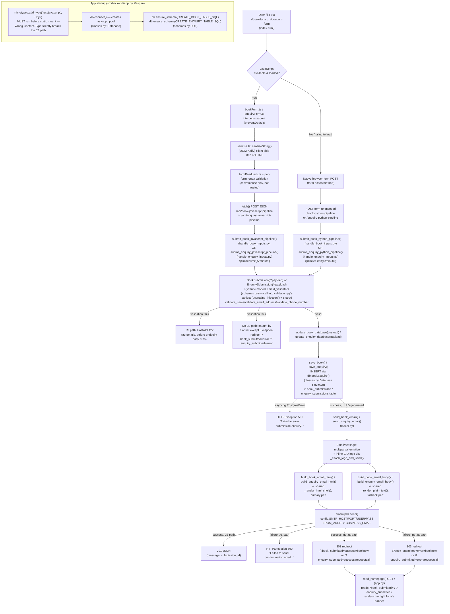

# Submission Pipelines — Architecture

This documents the current, live request pipelines for the two forms on the site — the "book your
vehicle in" form (`#book-form`) and the "not sure what your vehicle needs?" enquiry form (`#contact-form`),
both in `src/frontend/templates/index.html` — from browser submit through to email notification.

(Note: the Linoor theme's own HTML/CSS still calls the booking form "quote" — `class="get-quote-section"`,
`<!--Get Quote Section-->` — since that's presentational, prebuilt-template markup left untouched. Only
the underlying form id and the entire Python/TypeScript data model use "book" naming below.)

The two pipelines are structurally identical, split one-per-form throughout the stack: separate
TypeScript files, separate routers, separate Pydantic models, separate DB tables, separate email
builders, sharing only what's genuinely form-agnostic (sanitisation helpers, the shared email
shell, `app.py` wiring). See the module table below for exactly what's shared vs. duplicated.

## Diagram

## Module-by-module walkthrough

| Layer               | File                                                     | Responsibility                                                                                                                                                                                                                                                                                                                                                                                                                                                                                                               |
| ------------------- | -------------------------------------------------------- | ---------------------------------------------------------------------------------------------------------------------------------------------------------------------------------------------------------------------------------------------------------------------------------------------------------------------------------------------------------------------------------------------------------------------------------------------------------------------------------------------------------------------------- |
| Form markup         | `src/frontend/templates/index.html`                      | Renders `#book-form` (`action="/book-python-pipeline"`) and `#contact-form` (`action="/enquiry-python-pipeline"`), both `method="post"`, as native no-JS fallback targets.                                                                                                                                                                                                                                                                                                                                                   |
| Client JS (booking) | `src/frontend/typescript/bookForm.ts`                    | Intercepts submit (`preventDefault()`), sanitises via `sanitise.ts`, validates format/required-ness client-side (convenience only), then `fetch()`-POSTs JSON to `/api/book-javascript-pipeline`.                                                                                                                                                                                                                                                                                                                            |
| Client JS (enquiry) | `src/frontend/typescript/enquiryForm.ts`                 | Mirrors `bookForm.ts` structurally for `#contact-form` — its own validation rules (subject/message length instead of registration/service), `fetch()`-POSTs to `/api/enquiry-javascript-pipeline`.                                                                                                                                                                                                                                                                                                                           |
| Client JS (shared)  | `src/frontend/typescript/sanitise.ts`, `formFeedback.ts` | `sanitise.ts` wraps DOMPurify (`sanitiseString()`) for both forms. `formFeedback.ts` holds `displayErrors()`/`clearErrors()`/`showSubmitMessage()` — shared per-field error and banner rendering so both forms behave identically.                                                                                                                                                                                                                                                                                           |
| App wiring          | `src/backend/app.py`                                     | FastAPI instance, `lifespan()` (DB pool connect/schema/close for both tables), CORS + `SecurityHeadersMiddleware`, static mounts (`/static`, `/dist`), the `mimetypes.add_type(".mjs")` gotcha, `app.include_router()` for both routers, and the `GET /` `read_homepage` route (reads `?book_submitted=`/`?enquiry_submitted=` for the no-JS banners).                                                                                                                                                                       |
| Config              | `src/backend/config.py`                                  | Env-loaded settings (`DATABASE_URL`, `DEBUG`, SMTP/email vars), the module logger, and the shared `limiter` (`slowapi.Limiter`) instance — defined here (a dependency-free leaf module) so `app.py` and both routers import the same instance without a circular import.                                                                                                                                                                                                                                                     |
| Shared classes      | `src/backend/classes.py`                                 | `SecurityHeadersMiddleware` (adds `X-Content-Type-Options`, `X-Frame-Options`, `X-XSS-Protection` to every response) and `Database` — a thin asyncpg pool wrapper (`connect()`, `close()`, `ensure_schema()`), exposed as the `db` singleton both routers import.                                                                                                                                                                                                                                                            |
| Types               | `src/backend/_typing.py`                                 | The `Service` enum (`Diagnostics`, `Tyres`, `Servicing`, `Batteries`, `Exhausts`, `Repairs`) — booking-specific, unused by `EnquirySubmission`.                                                                                                                                                                                                                                                                                                                                                                              |
| Sanitisation        | `src/backend/validation.py`                              | `sanitise()` / `contains_injection()` (+ `INJECTION_PATTERNS`), plus the shared field validators `validate_name()`, `validate_email_address()`, `validate_phone_number()`, `check_no_blank_string_fields()` — form-agnostic helpers both `BookSubmission` and `EnquirySubmission` call into.                                                                                                                                                                                                                                 |
| Schema              | `src/backend/schemas.py`                                 | `BookSubmission` and `EnquirySubmission` — separate Pydantic models, each with its own field validators calling into `validation.py`, plus a `model_validator` belt-and-braces blank check each. Also `CREATE_BOOK_TABLE_SQL` (`book_submissions` DDL) and `CREATE_ENQUIRY_TABLE_SQL` (`enquiry_submissions` DDL), both run once at lifespan startup.                                                                                                                                                                        |
| Endpoints (booking) | `src/backend/routers/handle_book_inputs.py`              | `save_book()`, `update_book_database()` (wraps `asyncpg.PostgresError` as `HTTPException(500)`), and both POST endpoints — `submit_book_javascript_pipeline` (JSON, `201`/`HTTPException`) and `submit_book_python_pipeline` (form fields, `303` redirect either way).                                                                                                                                                                                                                                                       |
| Endpoints (enquiry) | `src/backend/routers/handle_enquiry_inputs.py`           | Mirrors `handle_book_inputs.py` exactly for the enquiry form: `save_enquiry()`, `update_enquiry_database()`, `submit_enquiry_javascript_pipeline`, `submit_enquiry_python_pipeline`. Kept as a separate module (not folded into the booking router) so each form's pipeline can be read, tested, and changed independently.                                                                                                                                                                                                  |
| Email               | `src/backend/mailer.py`                                  | Both pipelines' email building/sending in one module. `_render_html_shell()`/`_render_plain_text()`/`_render_field_rows_html()` are the shared layout the two pipelines' emails can't visually drift apart from; `build_book_email_html`/`build_book_email_body`/`send_book_email` (booking) and `build_enquiry_email_html`/`build_enquiry_email_body`/`send_enquiry_email` (enquiry) build on top; `_attach_logo_and_send()` is the shared inline-CID-logo + `aiosmtplib.send()` tail both `send_*_email()` functions call. |

## Key properties worth calling out

- **Split, not shared, business logic**: the booking and enquiry pipelines duplicate their router/schema/email-builder structure deliberately, one file (or one clearly separated section) per form — only the genuinely form-agnostic pieces (`validation.py`, the `mailer.py` render-shell helpers, `app.py` wiring, `Database`/`SecurityHeadersMiddleware`) are shared. This keeps either form's pipeline changeable without risking the other.
- **Single source of truth per form**: within one form, both its endpoints build the exact same Pydantic model and call the exact same `update_*database` → `save_*` → `send_*_email` sequence — no separate/duplicated business-logic path between the JS and no-JS routes for that form, only the transport (JSON vs. form-urlencoded) and response shape (JSON vs. redirect) differ.
- **Store-before-notify ordering**: the DB write always happens before the email send, in every endpoint — a failed email notification never loses an already-persisted lead.
- **MIME negotiation, not app logic**: the HTML-vs-plain-text choice inside a sent email is standard `multipart/alternative` behavior handled by the _receiving_ mail client — nothing in `mailer.py` branches on it.
- **The `.mjs` MIME-type gotcha**: `mimetypes.add_type("text/javascript", ".mjs")` in `app.py` must run before the `/static` mount is registered. Without it, `purify.es.mjs` can be served as `text/plain` on some OSes, which — combined with `SecurityHeadersMiddleware`'s `X-Content-Type-Options: nosniff` — makes the browser silently refuse to execute DOMPurify as a module, with no console error, silently falling all traffic back to the no-JS path (for whichever form triggers it).
- **Rate limiting**: every JS/no-JS endpoint pair (booking and enquiry alike) shares the same `5/minute` limit (`config.limiter`, keyed by remote IP), independent of the app-wide `5/hour` default limit also attached via `app.state.limiter`.
- **`GET /` is a render target, not a submission endpoint**: the no-JS POST handlers redirect (`303`) back to `/?book_submitted=...` (booking) or `/?enquiry_submitted=...` (enquiry) after doing the real save/email work, since a plain `<form>` can't show an in-page result the way `fetch()` can. `read_homepage()` just reads whichever flag is present to pick a banner — see `docs/development_journal.md` -> "Redirect-after-POST" for the full rationale.
